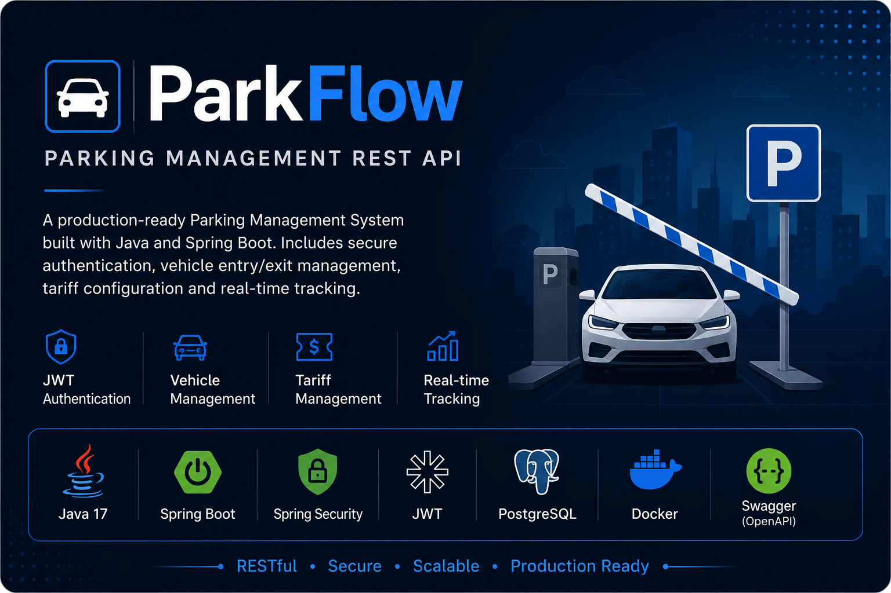
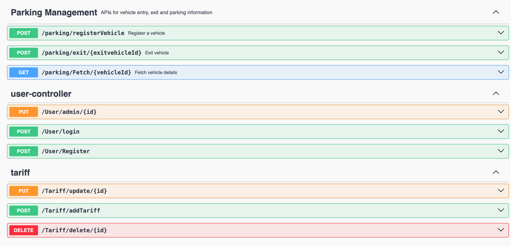

<p align="center">
  
</p>


# 🚗 ParkingTask

A production-style Parking Management REST API built using Java and Spring Boot. The application provides secure user authentication with JWT, role-based authorization, vehicle entry and exit management, parking tariff administration, and automated parking fee calculation.

## 🚀 Tech Stack

- Java 17
- Spring Boot 3.5
- Spring Security
- JWT Authentication
- PostgreSQL
- Docker & Docker Compose
- Swagger (OpenAPI)
- Maven
## 📸 API Documentation

### Swagger UI



## ✨ Features

- User Registration & Login
- JWT Authentication
- Role-Based Authorization (Admin/User)
- Vehicle Registration
- Vehicle Exit
- Parking Fee Calculation
- Tariff Management
- Swagger Documentation
- Docker Support

## ▶️ Getting Started

### Prerequisites

- Java 17
- Maven
- PostgreSQL

### Run the Application

```bash
mvn spring-boot:run
```

### Swagger UI

```
http://localhost:8080/swagger-ui/index.html
```